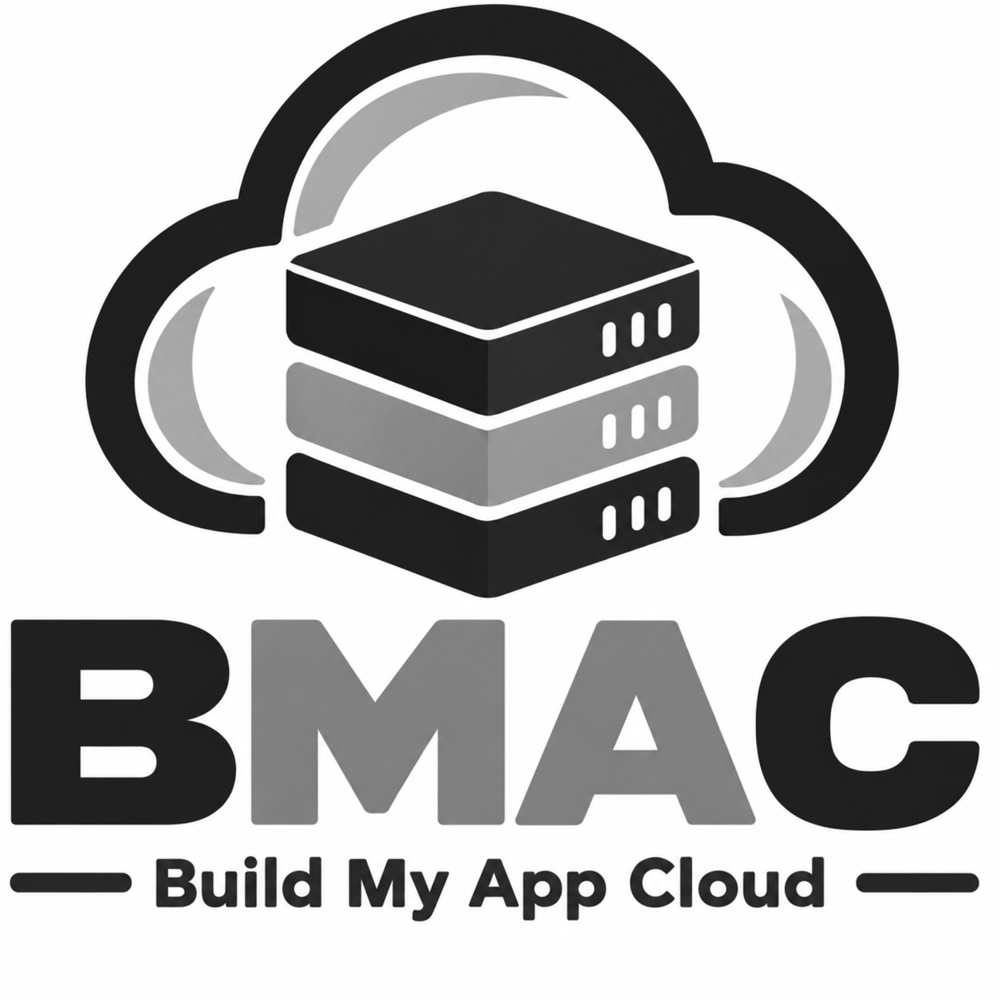

# BMAC - Build My App Cloud

## Intro



Sick of paying out-the-nose for hyperscaler cloud hosting? Trying to find your way out of their pricing labyrinth? Disillusioned with the complexity and the proprietary cloud APIs needed to glue-together a serverless architecture and their lock-in effect?

You're not the only one who noticed that the public clouds aren't really necessary for many webapps, even at scale.  Now that a single x64 server can host 1024 concurrent threads, all sharing the same RAM, the vertical-scaling ceiling is very high, which means that horizontal-scaling often isn't necessary.  That's a cloud-in-a-box.  For most apps you'll never need more, but you don't want to start with such an expensive box.  What you need is the ability to start with affordable hardware, suitable for your initial workload, with an easy way to migrate to better hardware as you grow, with minimal downtime, and with data-redundancy and high-availablity-failover baked-in so your data's safe.  You also need a system for testing upcoming changes to production without actually affecting production.  That's what BMAC delivers.

<br clear="left">

## BMAC's Features

- Grokable.  With moderate reading, BMAC can be understood without spending weeks to ramp up.  The complete design is [here](MAIN_DESIGN.md).
- Simple App Architecture.  Your webapp's deploy target environment is the same environment as your dev workstation - a computer.  Build and test your webapp all on your own computer and then deploy your built webapp to your BMAC production guest VM (ex: prod1).  BMAC supports many webapps so you can use BMAC to extend the cluster to support them all.  This enables you to use monolithic architecture which is one of the simplest app architectures.
- Test Using Actual Production State Without Affecting Production.  This is one of the killer features of BMAC, which handles all the setup steps for you.  Your standby host is not useless as it sits there waiting to act as a failover host.  Instead, it's actively leveraged to host your staging VMs, which are the VMs you push new changes to in order to test those changes prior to pushing them to the production VM.  Since all of the data for the production VM's disk is replicated by ZFS to the standby host(s), that data, on a standby host, can be used as the source for a temporary staging VM without any additional data copy.  This is done by making a temporary ZFS snapshot (removed when the staging VM itself is removed), and making a linked-clone of that snapshot on the standby host. The linked-clone of the snapshot is a fast and lightweight operation, using Copy-on-Write (CoW), and this linked clone acts as the hard disk for the new staging VM. Prior to attaching the linked clone to the staging VM, the linked clone is mounted on the standby host and its contained EXT4 filesystem is patched in order to alter the machine identity (IP, MAC address, hostname, machine ID, etc) of the machine so that the new staging VM doesn't collide with the production VM it's derived from.  An optional custom script can also be added to perform application-specficic patching, if desired.  Your staging VMs are visible with functional HTTPS access via a browser. Typically you'll want to have a custom app-specific patch which flips settings on your webapp in the staging VM to cause it to be in 'staging mode' such as to limit who can login, etc., as your staging VM can be fully accessible on the Internet for HTTPS browser access.  Your webapp can also look at the hostname - if it begins with 'stage' then your app knows it's running on a staging host, and can change its behavior.  During a failover event for a production VM, any staging VMs on the failover host are automatically stopped and removed, in order to ensure that the production VM has sufficient resources (RAM, CPU).
- Failover With Little Downtime.  Your production VM is a High-Availability (HA) guest/VM, so all of your production VM's disk data is replicated using ZFS async replication as often as once-per-minute from your production guest VM's primary host to the other placement hosts in the cluster.  If the primary host dies then the production VM is automaticlaly started on a standby host.  So failover downtime is the time to boot the VM and start its services.  Since the ZFS replication is async and at most once-per-minute, at most 1 minute of DB transactions may be lost in a critical host failure scenario, so BMAC is not suitable if your webapp requires zero data loss during failure events.  Email alerts are sent on both the failure and recovery.
- Scale Up with Little Downtime.  When your resource needs grow beyond the capacity of your intial hardware, add new hardware to your cluster and increase the 'placement' of your production VM to those new machines, which will cause all of the VM's data to be replicated, using ZFS, to those new cluster hosts.  When the data is fully replicated you can then migrate the VM to run on the higher-capacacity hosts and decomission the lower-capacity servers. Flipping that switch is a one-time reboot time cost of the production VM, so the downtime for such a migration, an uncommon event itself, is on the order of a few minutes at most.
- Full At-Rest Disk Encryption.  Many webapps need to satisfy security requirements and so BMAC has the option to configure all cluster hosts with disk-level encryption using LUKS.  When this option is enabled, you must enter a password on the hosts during host boot.  All mirror members for all mirror sets (each mirror is called a vdev) share the same password, so only one password must be entered at boot time.
- Software RAID1, Including OS Boot Volume.  Even if your servers don't have a hardware RAID controller, BMAC will configure them with ZFS RAID1, mirroring each set of identical-capacity disks. During host setup, BMAC also offers the option to fully-test failure scenarios for each mirror member of the boot disk RAID1 set in order to prove host bootability.  BMAC also ensures that each boot disk has a mirrored EFI System Partition (ESP), in addition to mirroring the ZFS partition.  For servers that support host-swap of NVMe disks, this enables each server to endure a single-member disk failure for each mirror set without any downtime or data loss.  Simply pull the failed disk, insert an identical-capacity replacment, and resilver the mirror set.
- Dell iDRAC9 IPMI support.  BMAC has been tested on Dell Poweredge R640 'Dual Intel Xeon Gold 6138 40 core/80 thread' hosts at FiberState, and one of the host setup script options is to use iDRAC to simplify hardware discovery. This is not required, and a hardware discovery script is provided in cases where you're using some other type of host.
- BMAC's architecture supports decommissioning hard disks you no longer need. Scripts for this have not yet been written, yet the possibility is there by doing the following:  Deleting files within the production VM's EXT4 filesystem, then run a TRIM operation within the production VM to send SCSI opcodes to its disk, which pass through to the host, notifying it of blocks which are no longer in use on the guest's zvol, this causes the ZFS pool on the host to mark those blocks free. When sufficient space is free then vdevs on the host can be removed from the host ZFS pool which causes ZFS to move any remaining allocated blocks on such a vdev away to other vdevs, then the disks for those removed vdevs can be physically removed from the host.  Such a situation may occur if you have, for instance, moved much of your data to CEPH, or elsewhere, and need to decommission drives you no longer need.  Future plans for BMAC include tooling to provision and manage an integrated CEPH cluster.

## What You Need to Use BMAC

- 2 servers with UEFI BIOS, each with their own public IP and Internet gateway connection on a primary NIC, and a private network connection between these two servers on a secondary NIC on each (can be a VLAN).  We prefer [FiberState's 'Dedicated Server' option](https://www.fiberstate.com/dedicated-servers) (we have no affiliation, we're just a satisfied customer as FiberState is competitively-priced, particularly if you pay for a year in advance).  These will be your main cluster hosts, hosting the guest VMs which in turn host your webapp(s).  You can add more than 2 servers if you like, but start with 2.
- Each server must have at least two identical-capacity physical NVMe hard disks for the ESP and OS partitions
- 1 ultra-cheap VPS host with a public IP address, such as a $5/month Shared CPU Nanode 1GB VPS at Linode.  This node's sole purpose will be to play the role of a QDevice, to vote in your cluster quorum to break tie votes.
- A developer workstation running a debian-based Linux distro (we made and tested this with x64 Ubuntu) to run BMAC's scripts.  This is required for the host setup scripts, but the prod/staging scritps work on macOS too.
- A Tailscale account (the free account will work fine)
- Your app's domain (ex: 'myapp.com'), managed at Cloudflare (not essential, but our guides assume this)

## BMAC's Stack

- Proxmox
- LUKS
- ZFS 
- Corosync
- HAProxy
- VRRP+keepalived
- Cloudflare
- Tailscale
- Ubuntu Server x64 (default OS for prod and staging guests)

## Step-by-Step Guide

Prepare for Proxmox Host Setup

- If you're using iDRAC, make sure you can access it.  Additional tips on setting up iDRAC with FiberState are provided in a section below.
- Read the top of `env/secrets_dot_env` and make a copy of it as the instructions direct, to `env/secrets.env` and choose your password values.  If you're using iDRAC then make sure all of your hosts use the same iDRAC password and set it in your `env/secrets.env` file.
- Set appropriate values in `env/cluster.conf` and `env/mox1` and `env/mox2` relevant to your hardware and network. The default values are for hosts with 128GB RAM where each host has two identical 2TB NVMe disks and 40 cores capable of 80 threads (so 80 vCPUs), and where they share a private network connection on subnet 10.213.0.0/24, and where each host has a public IP with an intenet gateway.  You'll need to adjust all of the IP address and subnet values to be accurate for your own hosts' IP addresses and subnet.  If your hosts have a different hardware level (CPU, RAM, storage) then you'll need to adjust the provisioning values for storage, CPU and RAM to be suitable for your hardware and their expected workload, for the production and staging guests.  You must also determine the serial numbers of your host's NVMe drives to be used for the initial OS/boot disk mirror.  If you're using iDRAC you can display these serial numbers in the iDRAC web UI.  When you run the `hosts/setup_proxmox_host.sh` script to set up each of your hosts, if you choose to use iDRAC then it will determine the byte capacity values for you, however if you're not using iDRAC then you should use the `hosts/inventory_disks.sh` script (run this in a Live/Trial Linux CD/USB in non-install mode) to obtain the disk serial number and byte capacity values to be set in the `env/mox1.conf` and `env/mox2.conf` files.  Be sure to also set the PROXMOX_PUBLIC_MAC and PROXMOX_SECONDARY_MAC values in your moxN.conf files to match the MAC addresses on your hardware for their primary and seconary NICs.
- Download the Proxmox VE x64 installer ISO to your dev workstation (the machine from which you'll be running `hosts/setup_proxmox_host.sh`) and set its path and SHA256 hash value in `env/cluster.conf` for PROXMOX_ISO_FILE_FULL_PATH and PROXMOX_ISO_FILE_SHA256.
- Add your (and another colleague's) SSH public key to the ADMIN_1_PUBLIC_SSH_KEY and ADMIN_2_PUBLIC_SSH_KEY values in `env/cluster.conf`
- Follow the instructions in `qdevice/QDEVICE_MANUAL_SETUP.MD` to set up your qdevice and add it to your tailscale network. Before doing that you'll need to follow the Tailscale setup steps below to add the appropriate tailscale tags and access policies.
- Follow the Cloudflare instructions to setup your website's domain for active/passive load-balancing.  This will cost you ~$5/month.

If you've completed the above steps then you're now ready to setup your Proxmox cluster hosts.  From a Debian-based (such as Ubuntu) workstation, run the `hosts/setup_proxmox_host.sh` script and choose to setup `mox1`.  A Debian-based workstation is required for the Proxmox host setup because that script must create a custom Proxmox installer ISO, and the Proxmox project only provides a Debian-based helper tool for this task.  Follow the `hosts/setup_proxmox_host.sh` script's instructions.  You  can actually run the same script in another terminal session to setup `mox2` at the same time, however I recommend at the point where the scipt asks you if you have verified that the VLAN (or private network connedtion) is working, that you only let one script at a time proceed past that point rather than letting many run beyond that point concurrently.

After our cluster is configured, you should be able to access the Proxmox admin web UI at:  [https://mox1:8006/](https://mox1:8006/) or [https://mox2:8006/](https://mox2:8006/)

You can now use the `guests/prod/create_prod_vm.sh` script to create your first production VM to host your application, which will deploy a blank/vanilla Ubuntu x64 OS to that VM and setup SSH access, and nothing else.  You can always tear it back down if you're not satisfied with it using `guests/prod/destroy_prod_vm.sh`.  If you like, you can also deploy a test "hello world" static webapp to your new production VM using `app/deploy_hello_app_to_prod.sh`.

After creating a production VM, you can test creation and teardown of a staging VM, based on that production VM, using the `guests/staging/create_staging.vm` and `guests/staging/destroy_staging_vm.sh` scripts.

### Instructions for Cloudflare Setup


1. Under Domains | Overview click on your app's domain (such as mydomain.com), then under Domains | DNS, add a new DNS record with these settings:
    Name: www
    Type: A
    IPv4 Address: 192.0.2.1
    Proxied: Turned On


2. Create a Load Balancing monitor for mox1 and mox2. If you're still on the domains page then click "Back to Domains" to see the whole left-side menu and then under "Delivery & performance" | "Load Balancing" use the "Monitors" tab and create one monitor each for mox1 and mox2 (2 monitors total) with these settings (note that if you haven't yet enabled Load Balancing on your account, which costs ~$5/month, you'll need to enable it):

    ```
    Name: mox1-mydomain-http-healthz
    Type: HTTP
    Path: /healthz
    Port: 80

    Name: mox2-mydomain-http-healthz
    Type: HTTP
    Path: /healthz
    Port: 80
    ```

3. Now under "Load Balancing" on the "Pools" tab create one pool each for mox1 and mox2 (2 pools total) with these settings:

    ```
    Pool Name: mox1
    Pool Description: Proxmox host mox1
    Endpoint Steering: Random
    Endpoint Name: mox1
    Endpoint Address: enter the public IP address of your mox1 host here
    Port: empty
    Weight: 1
    Enabled: checked
    Health Threshold: 1
    Monitor (select the mox1-mydomain-http-healthz monitor you already made)
    Health Check Regions: All Data Centers
    Health Check Notification: checked, either
    Notification Email: enter your email address here

    Pool Name: mox2
    Pool Description: Proxmox host mox2
    Endpoint Steering: Random
    Endpoint Name: mox2
    Endpoint Address: enter the public IP address of your mox2 host here
    Port: empty
    Weight: 1
    Enabled: checked
    Health Threshold: 1
    Monitor (select the mox2-mydomain-http-healthz monitor you already made)
    Health Check Regions: All Data Centers
    Health Check Notification: checked, either
    Notification Email: enter your email address here
    ```

4. Now back on the "Load Balancing" page on the "Load Balancers" tab you need to create two load balancers, one for the traffic to the prod guest on the primary host, and the other for traffic to possible staging guests on the standby host, for a total of 2 load balancers, with these settings:

    ```
    Hostname: mydomain.com
    proxy (orange checkbox): CHECKED
    load balancer description: mydomain.com load balancer
    Session Affinity: UNCHECKED
    Adaptive Routing: UNCHECKED
    Pools: Add mox1 and then mox2 in that order (this order is critical)
    Fallback Pool: mox2
    Attached Monitors should be set automatically since you already set them for the pools
    Traffic Steering: Off - this is what you want as this will do active/passive failover for you
    Custom Rules: none

    Hostname: *.mydomain.com
    proxy (orange checkbox): CHECKED
    load balancer description: *.mydomain.com load balancer
    Session Affinity: UNCHECKED
    Adaptive Routing: UNCHECKED
    Pools: Add mox2 and then mox1 in that order (this order is critical)
    Fallback Pool: mox1
    Attached Monitors should be set automatically since you already set them for the pools
    Traffic Steering: Off - this is what you want as this will do active/passive failover for you
    Custom Rules: none
    ```

5. Now Under Domains (click on your domain) | Rules | Overview, use "Create Rule" and choose "Redirect Rule" and in its settings choose these:

    ```
    Rule Name: Redirect from http/https www.mydomain.com to https mydomain.com
    CHECK "Wildcard pattern"
    Request URL: http*://www.mydomain.com/*
    Target URL: https://mydomain.com/${2}
    Status code: 301 - Permanent Redirect
    UNCHECKED "Preserve query string"
    Place at: First
    ```

6. Under Domains (click on your domain) | SSL/TLS | Origin Server | Origin Certificates click 'Create a certificate' with these settings:

    ```
    Private Key type: RSA (2048)
    Hostnames: mydomain.com and *.mydomain.com
    Validity: 15 years
    Save the certificate to a .cer file on your workstation.  This is the public key.
    Save the private key to a .key file in the same dir as the .cer file.  This is the private key.  Never share it.
    Both of these files will be fed to the `app/deploy_hello_app_to_prod.sh` script.
    ```

7. Under Domains (click on your domain) | SSL/TLS | Overview click "Configure" and select "Full (Strict)"

### Instructions for Tailscale Setup

Install Tailscale on your development workstation and login/connect with your Tailscale network.  Make sure you can see your dev workstation listed in the Tailscale web UI under "Network" | "Machines".

In your Tailscale account under "Access controls" | "Definitions" you'll find a "Groups" tab.  On the Groups tag you need to create a new group called proxmox-admins and add your user (and any other users you've invited) to this group.  Next, also in the "Definitions" page you'll see a "Tags" tab, and under that tab create the following tags, all owned by group:proxmox-admins:

tag:proxmox-host
tag:proxmox-qdevice

Next, navigate to "Access controls" | "Policies" and under "General access rules" add the following 5 rules:

```jsonc
// Admin SSH
{
	"src": ["group:proxmox-admins"],

	"dst": [
		"tag:proxmox-host",
		"tag:proxmox-qdevice",
		"tag:prod-guest",
		"tag:staging-guest",
	],

	"ip": ["tcp:22"],
}

// Proxmox Web UI
{
	"src": ["group:proxmox-admins"],
	"dst": ["tag:proxmox-host"],
	"ip":  ["tcp:8006"],
}

// QDevice/corosync-qnetd quorum traffic
{
	"src": ["tag:proxmox-host"],
	"dst": ["tag:proxmox-qdevice"],
	"ip":  ["tcp:5403"],
}

// Initial QDevice Setup by Proxmox Setup (temporary)
{
	"src": ["tag:proxmox-host"],
	"dst": ["tag:proxmox-qdevice"],
	"ip":  ["tcp:22"],
}

// Corosync/Kronosnet host-to-host links
{
	"src": ["tag:proxmox-host"],
	"dst": ["tag:proxmox-host"],
	"ip":  ["udp:5405-5412"],
}
```

Each time you set up a proxmox host, the script will prompt you for a unique Tailscale Auth Key.  You can generate in the Tailscale web UI unser "Settings | "Keys" and on that page under "Auth Keys" use the "Generate auth key..." button and give the key any name (typically something like `mox1`) of the key, make sure Reusable is Off, any expiration day count value is fine (as these will switch to never expiring once they're actually used), and keep Ephemeral Off, and most importantly turn Tags ON and select the tag:proxmox-host tag.  Generate the key and copy it somewhere so that you have it ready for when the `hosts/setup_proxmox_host.sh` script prompts for it.  You'll need one key for each proxmox host you setup.

Your SSH access from your dev workstation to your proxmox hosts will be via your Tailscale network.

### FiberState iDRAC VPN Setup

Since host setup must be done using a Debian workstation, there's a good chance you may be using the GNOME desktop environment, in which case you may run into issues setting up your FiberState IPMI VPN access.  Here's the workaround.

1. First in a web browser connect to the OpenVPN URL provided by FiberState.  When the browser complains about the certificate being non-CA-issued, show the certificate and double check to ensure it has the following values, and only if these values match should you proceed to the page:

    ```
    Certificate 3e0d142fdde35a78a0abdb346daf22406ed92b156d30442f8f473e7c7bdaa529
    Public Key 383b401d4257b7090945f6a893c47e3f8015bbd57ae1e74495711f96704dbe69
    ```

    If you see other values then submit a ticket to FiberState to ask them what the current valid fingerprints are for their HTTPS certificate for their IMPI web VPN server.

2. Once connected to the "Access Server" use the download link to download the "Connection profile."  This will download a .ovpn file that can be imported directly into Gnome's network settings for VPN connections. Note that you can test this .ovpn connection with your openvpn cli client directly, like  so:

    ```
    sudo openvpn --config ~/Downloads/FiberState_IPMI_VPN.ovpn --auth-user-pass
    ```

3. After importing the .ovpn file into Gnome's Network VPN settings, you need to make the following changes to the imported VPN connection:

    - In the Details tab check the "Make available to other users" tab
    - Add the username and password provided by FiberState in the Identity tab
    - In the IPv4 tab, under Routes, check the box labeled "Use this connection only for resources on its network"
    - In the IPv6 tab, under Routes, check the box labeled "Use this connection only for resources on its network"
    - At the bottom of the Identity tab, use the "Advanced" button to load the "Advanced Properties" dialog and in that dialog's "Security" tab change the Cipher from AES-256-CBC to AES-256-GCM.

## A Basic CI/CD Workflow

A simple CI/CD workflow can be made for most webapps by doing the following

You need to make a deploy script that can target a host using SSH to access that host.  This deploy script, if it finds that the target host has never been configured, should do initial configuration such as by updating the OS and installing things like NGINX etc.  This deploy script should be able to build all of your webapp's assets and copy them to the target host.  Prior to building, your deploy script should create a new tag in version control (usually git) of the code it's building.  This tag, in some form, should accompany the assets that get copied to the target host, so that it's always clear on that target host the exact code that was deployed, and when assets are deployed to a staging host the prior deployment tag value should be preserved on the staging host before the current deployment tag value is updated, so that for any staging host you can always determine the prior and current tag values - the prior tag value is the tag value of the assets that were deployed to production, and the current tag value is the tag value of the updated code that overwrote production's assets on your staging VM.  Your deploy script should also have a mode where it can be told of a staging VM that has passed tests, and that you wish that staging VM's code changes to be pushed to production.

1. Create your production VM (a one-time step for your webapp) by running `guests/prod/create_prod_vm.sh`
2. Test your webapp locally.  When it passes your tests, run your deploy script targetting the new production VM (ex: `prod1`)

Then for any future updates to production, do the following:

1. Build your webapp and test it locally on your own dev workstation.  When your local tests pass the next step is to test in staging.
2. Create a temorary staging VM using `guests/staging/create_staging_vm.sh`
3. Run your deploy script targetting the new staging VM (ex: `stage1prod1`)
4. Test your app in staging.  If it passes your tests then call your Deloy script with parameters sufficient to tell it that you wish to push staging to production, specifying which staging VM passed tests.  The depoy code must then look at the staging VM's prior tag and ensure that it still matches the production VM's current tag, and if they match then the deploy code must checkout the code at the staging VM's current tag and build that code and deploy it to production, updating production's old current tag with this new current tag.  This way you only ever push to production changes that have been made directly against both production's prior code state AND its data state.
5. Cleanup: Remove the staging VM using `guests/staging/destroy_staging_vm.sh`

## Why not use Kubernetes (K8s)?

Kubernetes is primarily a container-orchestration system. It assumes you already have machines, networking, storage, and a working cluster underneath it. BMAC operates at that lower infrastructure layer: it provisions and manages the bare-metal hosts, ZFS storage and replication, quorum, networking, ingress, and VM-level high availability.

Kubernetes also doesn't, by itself, solve persistent-storage or database failover. On bare metal you still need to choose and operate the storage system, and stateful applications generally need additional database-aware HA tooling. BMAC takes a simpler approach for applications that fit comfortably on one machine: the entire production VM, including its application and database state, is replicated and failed over as a single unit.

BMAC also provides a production-derived staging model that Kubernetes does not provide out of the box. Replicated production storage on a standby host can be turned into a lightweight Copy-on-Write staging VM, patched with a unique machine identity, tested independently, and discarded when no longer needed. The standby hardware therefore remains useful during normal operation while still being available for production failover.

BMAC doesn't prevent you from using Kubernetes. If your application benefits from containers, horizontal scaling, service orchestration, or Kubernetes deployment tooling, you can run Kubernetes inside VMs hosted by BMAC. The two systems solve different layers of the problem.

## History

This project was worked on, tested and used privately, with tons of commits, before being migrated to this public repo.  Our hope is to help others while garnering support from the community for self-built cloud infrastructure.

## Future

We have many more improvements planned for BMAC, including support for integrated CEPH.  For FiberState deployments, BMAC could be improved significantly if FiberState adds Internet ingress/egress capability from the VLAN.  This would drammatically-simplify the BMAC implementation, doing away with the need for HAProxy and VRRP+keepalived for ingress/egress routing, and the complex coordination and syncing these currently require.  More details on low-hanging-fruit changes that FiberState could make are in [`FUTURE.md`](FUTURE.md).