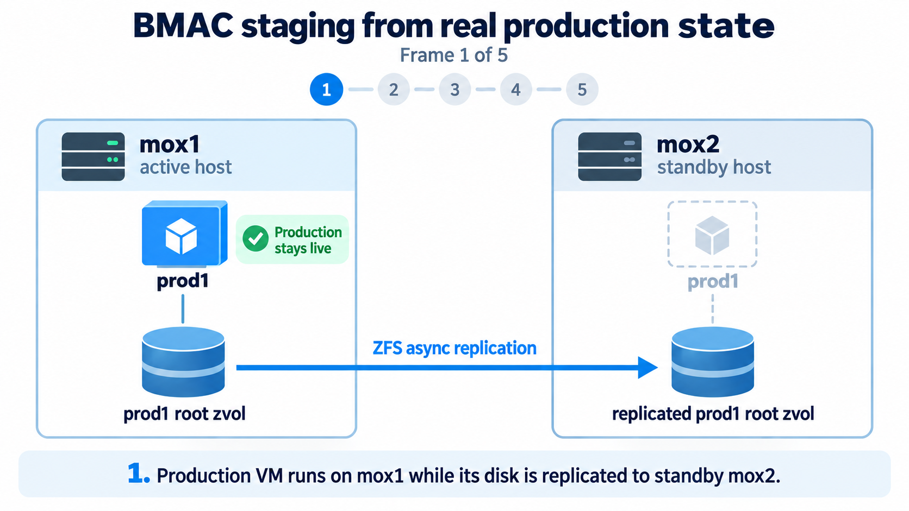
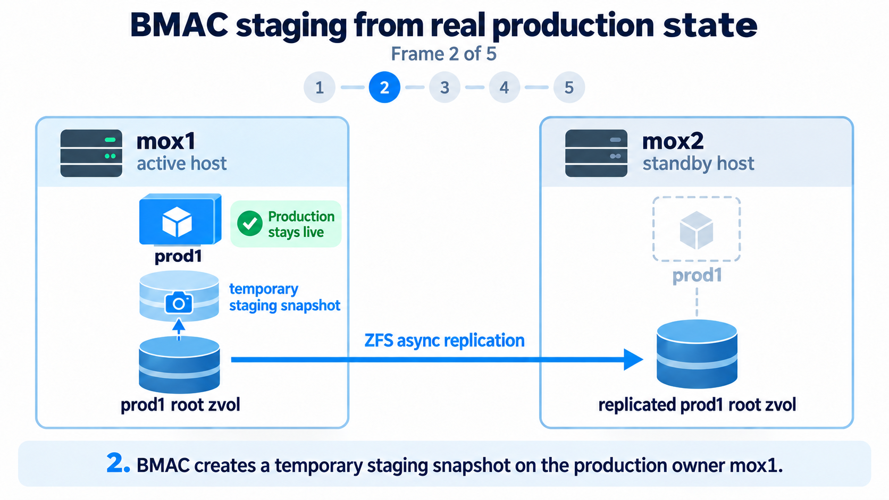
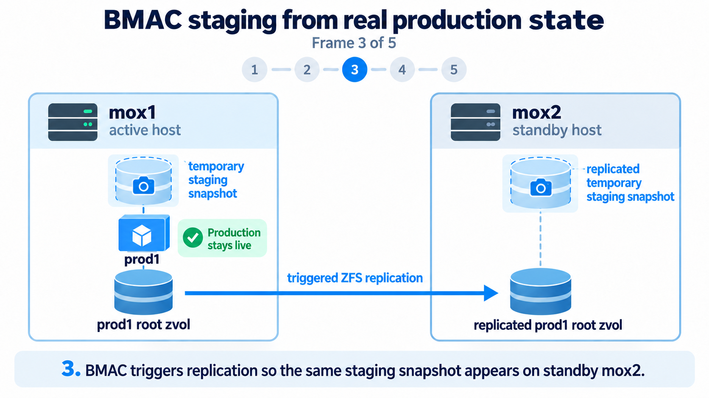
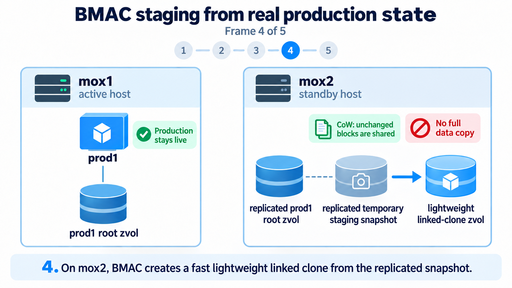
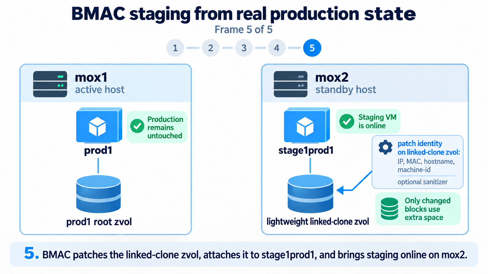

# Lightweight Staging

BMAC can quickly-create lightweight staging VMs for testing changes before pushing them to prod, using all of prod's data and state but without actually affecting prod.  The data state of the staging VMs contains *exactly* the data of the production VM at the time the staging VM is created.  This means that if youre production VM contains your database, then your staging VM will instantly have the exact same data in the exact same database, without any actual extra copy operation.  This enables you to truly test out changes against the real production state without actually affecting production itself, prior to making those changes to the actual production node.

## Stage 1 

Your production VM's disk is a ZFS zvol on the Proxmox host, and that ZFS zvol is being replicated with async ZFS replication, as often as once-per-minute, to a corresponding target zvol on the standby host.  This replication continues like clockwork even when you have created staging VMs on the target host, so your production data is still protected including new production data even when you are using staging guests on the standby host.

  

## Stage 2

When you use `/guests/staging/create_staging_vm.sh` to create a new staging VM based on a production VM, the script first creates a temporary staging snapshot on the actived host.

  

## Stage 3

After the temporary staging snapshot has been created on the active host, the `/guests/staging/create_staging_vm.sh` script then immediately triggers replication so that this same snapshot will be available on the standby host.

  

## Stage 4

A lightweight Copy-on-Write linked-clone of the temporary staging snapshot on the standby host in then created. This linked clone, itself a zvol, requires no additional data copy to be created, only new data written to it is stored.

  

## Stage 5

This linked-clone zvol is then mounted on the standby host and it EXT4 OS file system is patched in order to alter the machine identity (MAC address, IP address, machine ID, etc) so that the new staging VM, based on this linked clone,  After patching the linked-clone zvol, it's then dismounted from the standby host and then attached to a newly-created staging VM on the standby host.  This new staging VM on the standby host is then started.  It's available on the network and its webapp (the mirror-image of the production webapp including all of its state, database and all) is accessible through your browser at https://stage1prod1.yourdomain.com

If a failover occurs, which requires bringing prod1 online on the standby host, a startup hook will run before the prod VM is powered on, and this startup hook will ensure that if there are any active staging guests running on the standby host that those staging VMs will be powered off and removed before the prod VM is powered on.  This is a fast operation which ensures that the standby host has all of the RAM and CPU resources needed by the prod VM.

  

