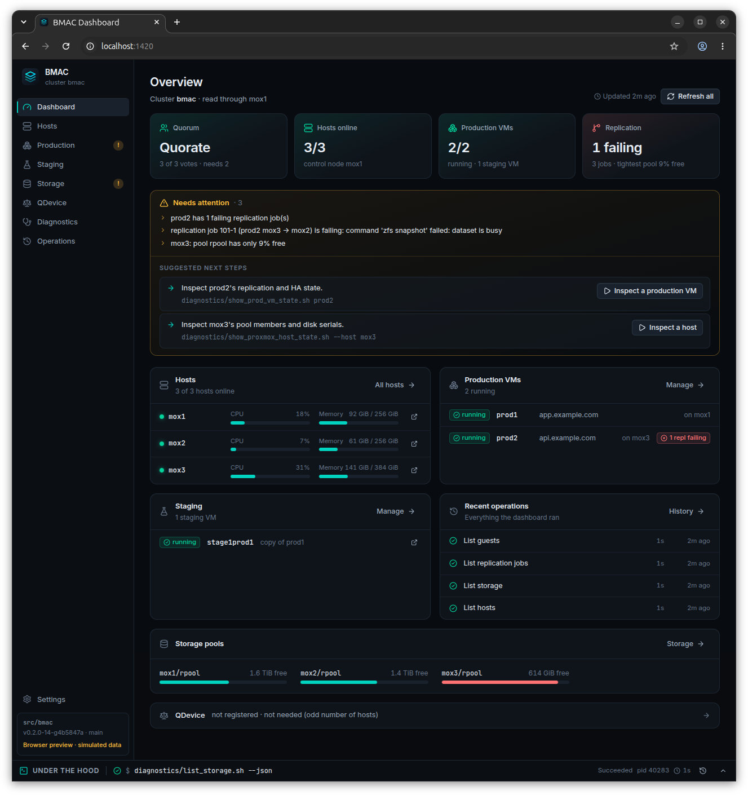
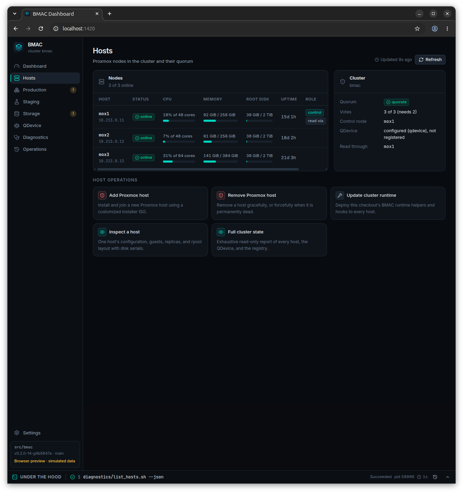
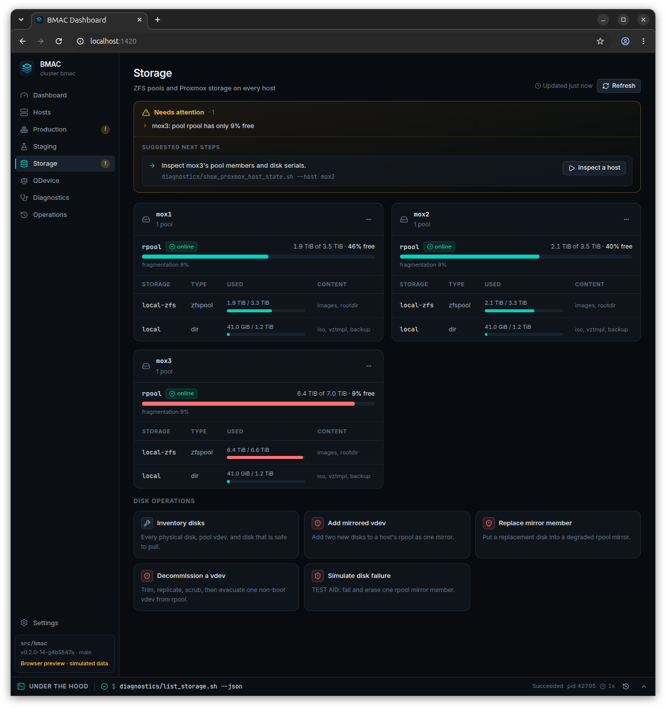
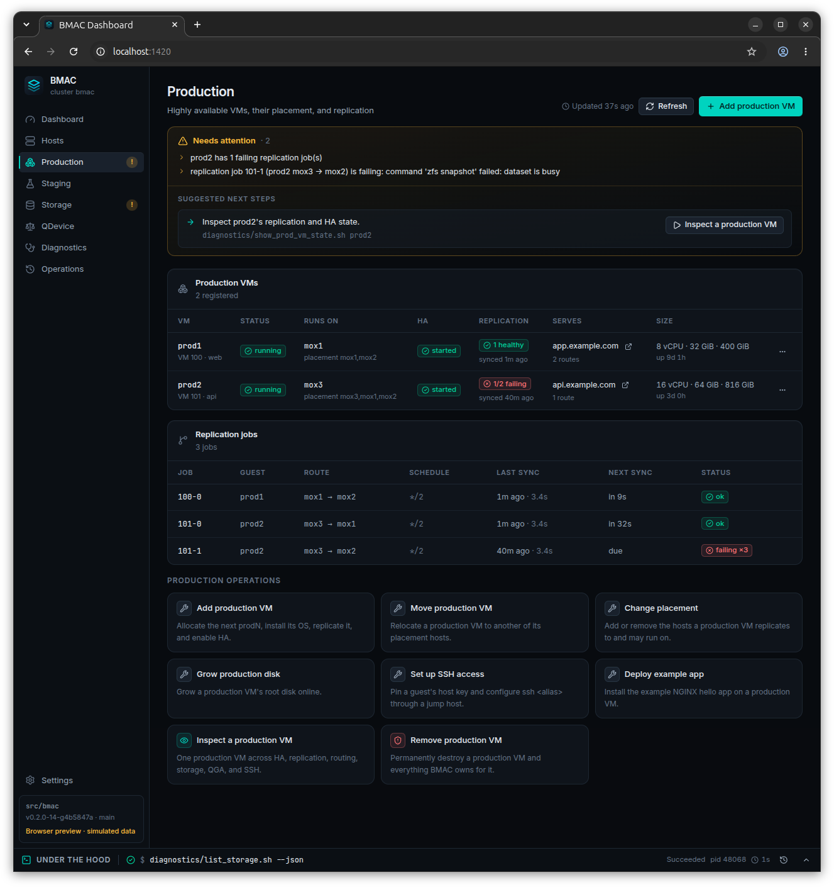
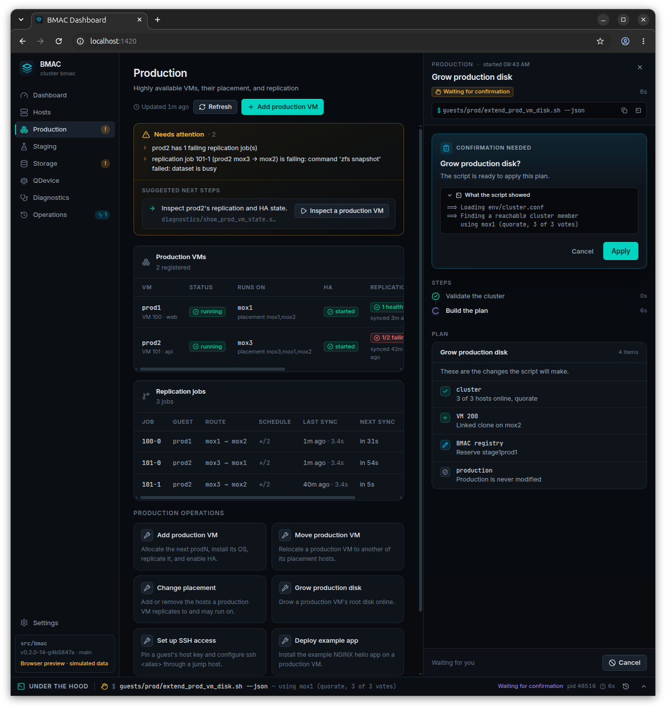
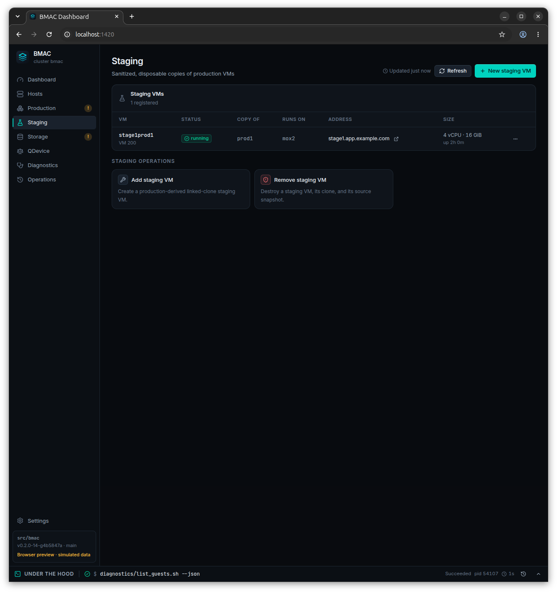
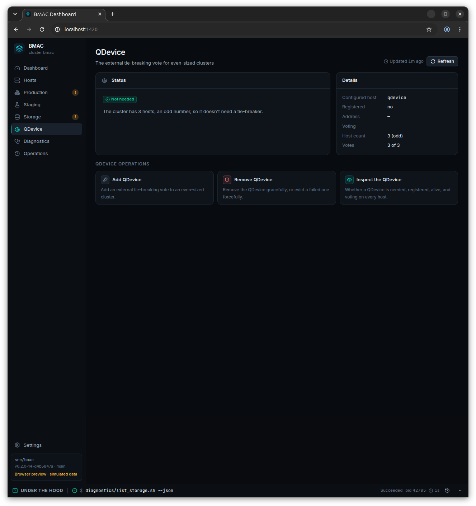
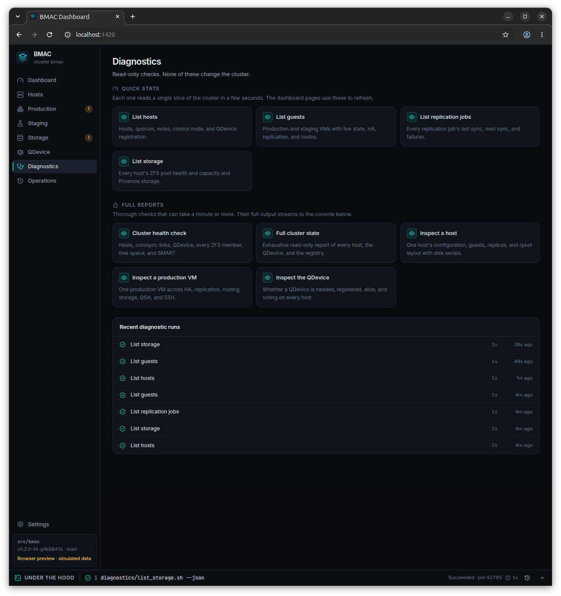
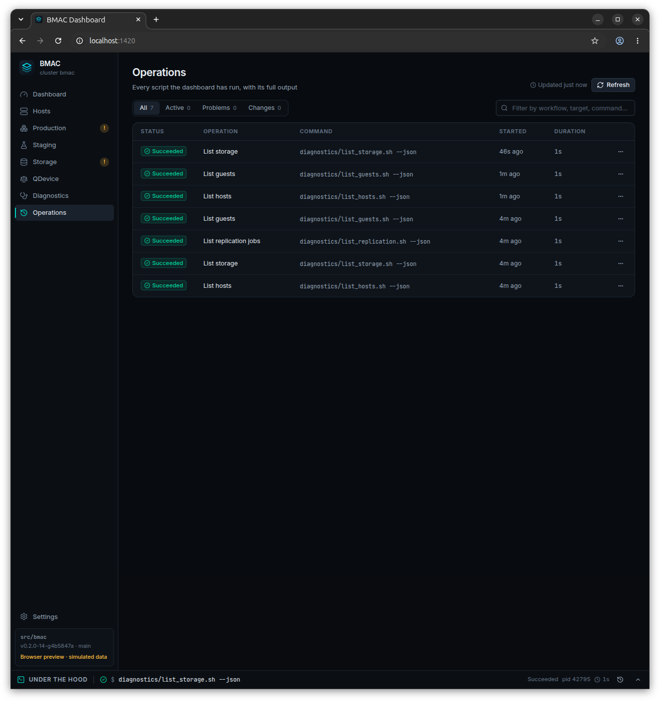
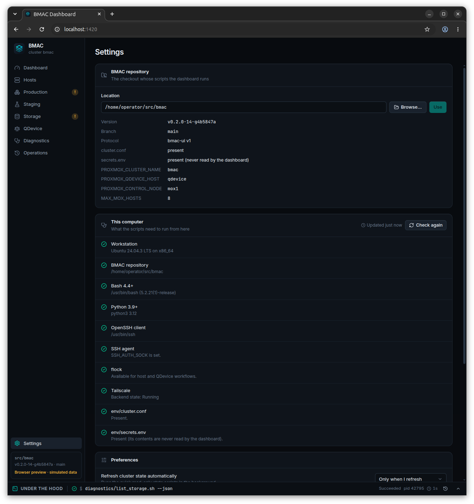

# BMAC Dashboard Screenshots

# Overview

The Overview page summarizes the status of the cluster, enumerating its hosts and their resource usage, the QDevice and its current role, any production and staging guests, and surfaces any cluster-level alerts or failures.

  

# Hosts

Here you can view your host status as well as add/remove Proxmox hosts to/from your cluster.

  

# Storage

This page shows the current storage configureation of each Proxmox host in your cluster and gives you the ability add additional disks, in sets of 2 as a new vdev, to a Proxmox host's existing ZFS pool of storage, which can in turn be passed on to any of your production guests through the Production guest extend storage features.  On this page you can also decommission a vdev that's no longer needed, which will perform a TRIM within any affected guests in order for the underlying ZFS pool to be able to optimally evacuate any remaining in-use blocks on the disks you're evacuating and decommissioning.  If you experience a mirror-memeber failure (which you can simulate as well) you can use this page to replace the failed member.

  

# Production

Here's where you manage your production VMs, with the ability to create, remove and change host ownership and replication placement.  As mentioned you can also use this page to extend the disk of a procuction VM.  The "Set up SSH Access" feature here is an easy way to configure safe jump-SSH acces to either production or staging guest, through one of your Proxmox hosts, from your dev workstation.  A sample Hello World webapp can also be deployed from here.

  

# In Progress Jobs

The panel on the right is used to interact with an in-progress job, and the "Under The Hood" bottom drawer can be expanded to show the details of the operating script for that job.  You can run multiple jobs simultaneously and you can switch which is shown in the panel on the right as well as in the "Under The Hood" section.  In this example we see a job underway to extend a production VM's disk.

  

# Staging

Here you can view and manage any staging VMs. Each staging VM is based on a snapshot of a production VM, using a linked-clone, which is a lightweight operation that doesn't require a full copy to occur.  These staging VMs enable you to quickly and easily test your new changes against your actual production state, without actually affecting production itself.  Staging VMs are created on the standby host, which is the ZFS replication target of the "owner" host which is running the production VM.

  

# QDevice

A healthy quorum requires an odd number >= 3, and so as you add/remove Proxmox hosts from your cluster, the QDevice will be automatically added and removed in order to maintain this requirement.  You can remove your QDevice either gracefully (if it's still online) or forcefully (if it has failed) and add a new QDevice using this page.

  

# Diagnostics

There are several levels of granularity when it comes to querying the health of your cluster.  To see the detailed output of these scripts see their output in the "Under the Hood" section at the bottom.

  

# Operations

Here you can see current (active) and past jobs that have been executed, including their runtimes and execution step history.

  

# Settings

BMAC lists its dependencies here and lets you specify a few preferences as well.

  

